# 🎥 YouTube Data Engineering Pipeline using AWS (End-to-End Data Pipeline)


---

## 🚀 Project Overview

In modern data-driven companies, millions of records are generated every day from platforms like YouTube, Instagram, Netflix, and e-commerce systems.

This project demonstrates how to build a **complete end-to-end cloud data engineering pipeline on AWS** that automatically extracts YouTube data, processes it through multiple transformation layers, and makes it available for analytics.

Using **AWS Lambda, Amazon S3, AWS Glue, AWS Step Functions, Amazon Athena, and SNS**, this pipeline automates data ingestion, transformation, orchestration, and querying.

This project follows **Medallion Architecture (Bronze → Silver → Gold)**, widely used in real-world data engineering systems.

---

## ❗ Business Problem

Companies need to analyze large amounts of YouTube data for:

❌ Trending video analysis
❌ User engagement analytics
❌ Category performance tracking
❌ Real-time reporting
❌ Business intelligence dashboards

Manual processing creates challenges:

• Large raw JSON data
• Difficult transformations
• Slow analytics processing
• Unstructured datasets

### Solution

Build an automated cloud data pipeline that:

✅ Extracts YouTube data automatically
✅ Stores raw data in S3 Bronze Layer
✅ Cleans data in Silver Layer
✅ Creates analytics-ready Gold Layer
✅ Enables SQL querying using Athena
✅ Sends automated notifications using SNS

---

## 🏗️ Architecture Diagram

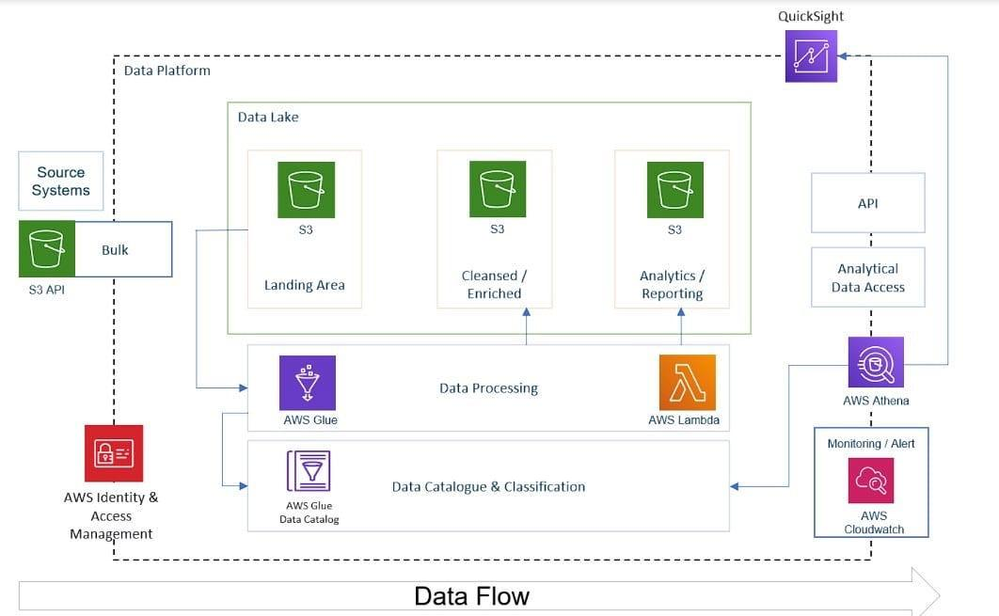

---

## ⚙️ Complete Pipeline Architecture

```text
YouTube API
     │
     ▼
AWS Lambda (Data Ingestion)
     │
     ▼
Amazon S3 Bronze Layer (Raw JSON)
     │
     ▼
AWS Glue ETL Job
     │
     ▼
Amazon S3 Silver Layer (Cleaned Data)
     │
     ▼
AWS Glue Transformation Job
     │
     ▼
Amazon S3 Gold Layer (Analytics Ready Data)
     │
     ▼
AWS Athena (SQL Queries)
     │
     ▼
AWS SNS Notification
```

---

## 📸 Project Screenshots

### ⚡ Lambda Function Created

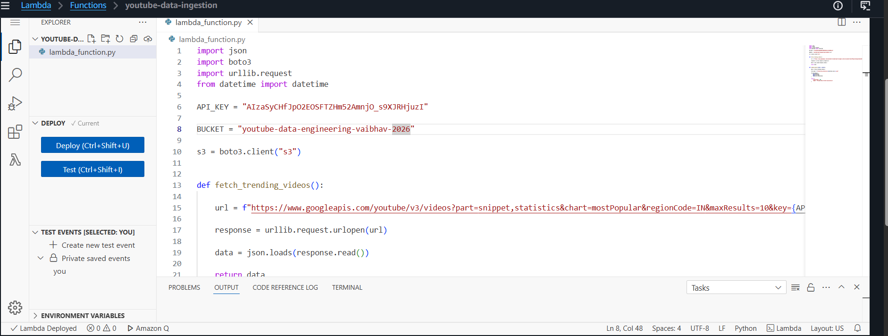

---

### ✅ Lambda Execution Success

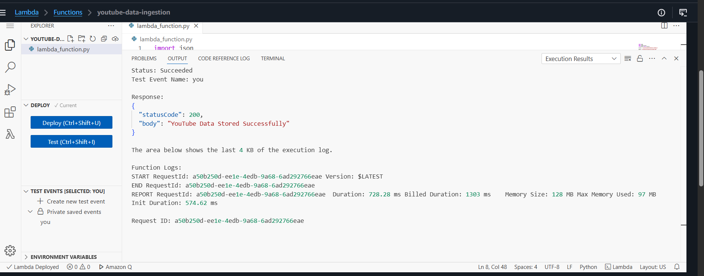

---

### 🪣 Amazon S3 Bucket Created

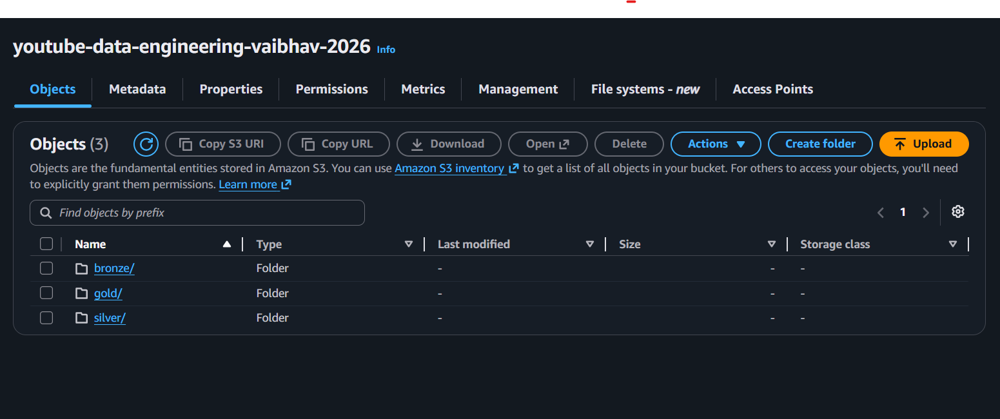

---

### 🥉 Bronze Layer (Raw JSON Storage)

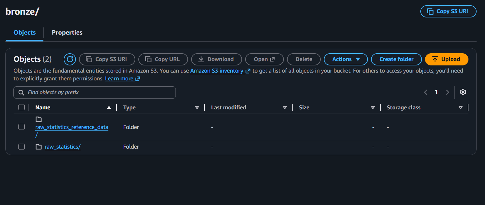

---

### 🥈 Silver Layer (Processed Data)

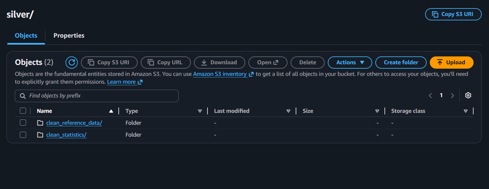

---

### 🥇 Gold Layer (Analytics Ready Data)

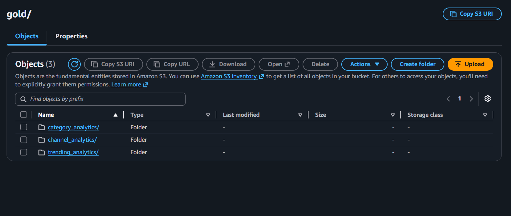

---

### 🔄 AWS Step Function Workflow

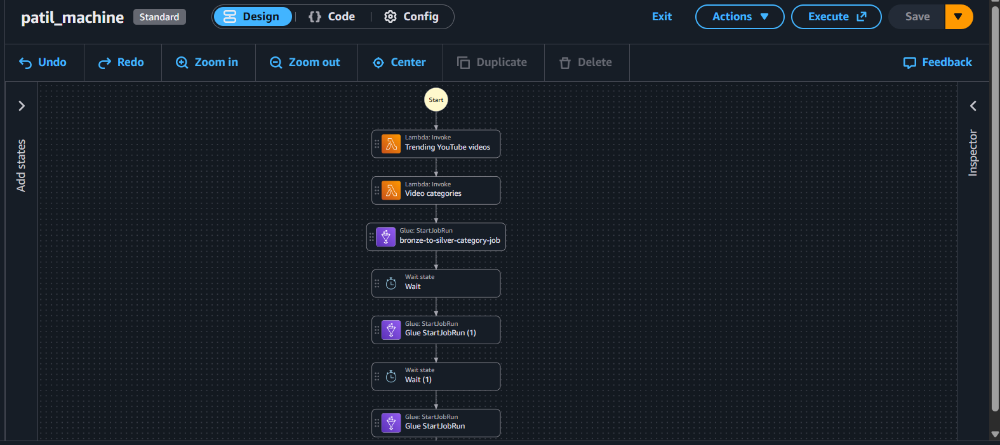

---

### ✅ Step Function Execution Success

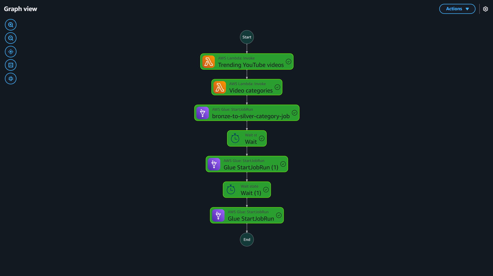

---

### 🔧 AWS Glue Jobs Created

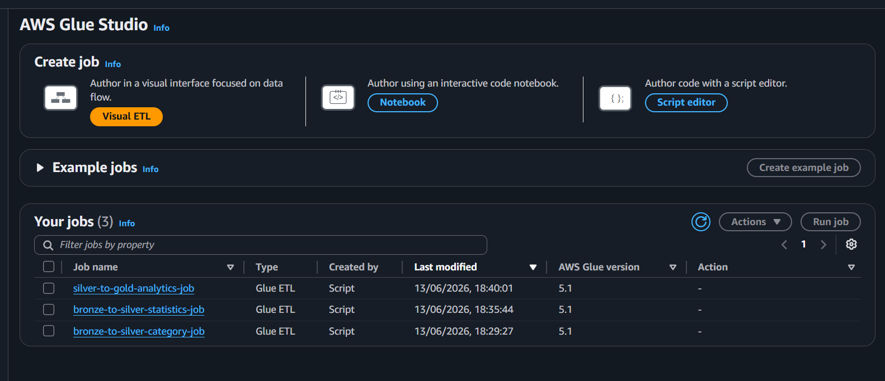

---

### ✅ AWS Glue Job Success

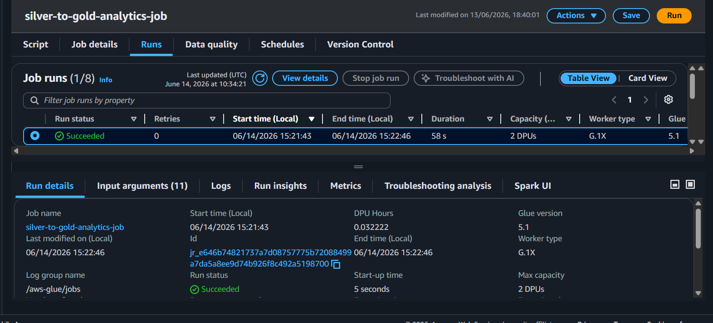

---

### 📊 Athena Query Results

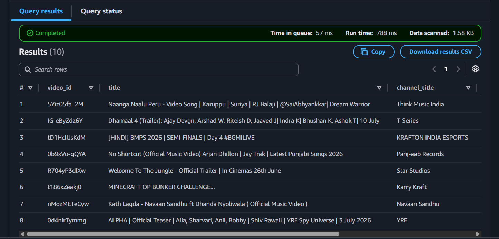

---

## ☁️ AWS Services Used

### AWS Lambda

Used for data ingestion from YouTube API.

Purpose:

• Extract YouTube API data
• Trigger pipeline execution

---

### Amazon S3

Used as storage layers.

Purpose:

• Bronze Layer → Raw JSON
• Silver Layer → Cleaned Data
• Gold Layer → Analytics Data

---

### AWS Glue

ETL service for data transformation.

Purpose:

• Clean raw data
• Convert formats
• Process structured datasets

---

### AWS Step Functions

Used for orchestration.

Purpose:

• Manage pipeline workflow
• Execute services in sequence

---

### Amazon Athena

SQL query engine for analytics.

Purpose:

• Query processed data
• Perform business analysis

---

### Amazon SNS

Notification service.

Purpose:

• Send pipeline success notifications
• Alert workflow completion

---

## 🏗️ Medallion Architecture

### 🥉 Bronze Layer

Stores raw unprocessed YouTube JSON data.

```text
Raw Data Storage
```

---

### 🥈 Silver Layer

Stores cleaned and transformed structured data.

```text
Processed Structured Data
```

---

### 🥇 Gold Layer

Stores analytics-ready final data.

```text
Business Intelligence Ready Data
```

---

## 🔄 Pipeline Workflow

### Step 1 — Extract Data

Lambda fetches data using YouTube API.

---

### Step 2 — Store Raw Data

Data stored inside S3 Bronze Layer.

---

### Step 3 — Data Cleaning

AWS Glue transforms raw data.

---

### Step 4 — Silver Layer Processing

Cleaned data stored in S3 Silver Layer.

---

### Step 5 — Final Transformation

Glue transforms data for analytics.

---

### Step 6 — Gold Layer Storage

Analytics-ready data stored in Gold Layer.

---

### Step 7 — SQL Querying

Athena runs SQL queries.

---

### Step 8 — Notifications

SNS sends success notifications.

---

## 🎯 Key Features

✅ Fully Automated ETL Pipeline
✅ Cloud Native Data Engineering Architecture
✅ Medallion Architecture Implementation
✅ Serverless Data Processing
✅ Scalable Cloud Storage
✅ SQL Analytics with Athena
✅ Workflow Orchestration using Step Functions
✅ Automated Notifications using SNS

---

## 📚 Skills Learned

Through this project I learned:

✅ AWS Lambda
✅ Amazon S3 Data Lake Architecture
✅ AWS Glue ETL Jobs
✅ AWS Step Functions Workflow
✅ Amazon Athena Querying
✅ Amazon SNS Notifications
✅ Medallion Architecture
✅ Cloud Data Engineering
✅ ETL Pipeline Design
✅ Data Lake Architecture

---

## 🌍 Real World Use Cases

This architecture is used in:

• Netflix Recommendation Systems
• YouTube Analytics Platforms
• E-commerce Data Pipelines
• Social Media Analytics
• Business Intelligence Systems
• Enterprise Data Warehouses

---

## 🚀 Future Improvements

Can be improved by adding:

• Apache Spark Processing
• Apache Airflow Scheduling
• Redshift Data Warehouse
• QuickSight Dashboards
• Real Time Kafka Streaming
• CI/CD Pipeline Automation
• Machine Learning Integration

---

## 🛠️ Tech Stack

AWS Lambda • Amazon S3 • AWS Glue • Step Functions • Athena • SNS • Python • ETL • SQL • Data Engineering

---

## 📊 Project Outcome

Successfully built a complete AWS cloud data engineering pipeline.

Achieved:

✔ Automated Data Ingestion
✔ ETL Data Processing
✔ Cloud Based Data Lake
✔ SQL Analytics Layer
✔ Automated Workflow Orchestration
✔ Production Style Data Engineering Architecture

---

## 👨‍💻 Author

**Vaibhav Thete**

GitHub:
https://github.com/Vaibhavthete12

LinkedIn:
https://www.linkedin.com/in/vaibhav-thete-b27734301/

---

## 🎉 Final Conclusion

This project helped me understand how modern companies build **large-scale cloud data pipelines** for analytics.

By combining **AWS Lambda, S3, Glue, Step Functions, Athena, and SNS**, I gained practical experience in building **production-grade Data Engineering pipelines used in real-world enterprise systems**.

This is one of my strongest projects demonstrating **Cloud Engineering + Data Engineering + ETL Pipeline Design**.
